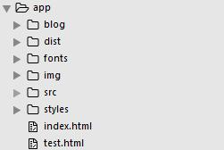

##总结
&emsp;经过3天的晚上，完成了leader布置任务的1/3。 ): 心塞~
&emsp;说一下这3天的任务经过吧~.
###First Day
&emsp;第一天，上午10:02分，leader的QQ头像一闪一闪，我的心跳也一闪一闪。因为有前几次面试的经历，所以那时候的心甚虚~。 

	上个面试官说:leader问的比我的都细，所以你准备下口粮吧~
&emsp;准备着又被虐一顿的心态，打开了QQ。 心情平静了许多。一下是对话:

	leader:hu,xx你好~
    me: leader,您好~
    leader: 最近还有课吗？
    me: 有，到了考试月~
    ...

&emsp;小伙子，你以为Leader和你来拉家常的吗？**too young too naive**
&emsp;接下来leader开始说任务了，我简单的说一下吧~
	
	1.爬去某网站的课程信息
	2.查看购买金额
	3.补充: 可按日期查询
&emsp;好吧，题目已经出了，那就just do it; 
**干货时间** 
&emsp;首先,拿到这个题目的时候，第一反应就是爬数据，好吧，虽然没有太多的经验，但还是勉强有些思路。不过,我的*plan*是先将基本展示的html做好.

这是我的目录结构:

==用到的知识点有:==

	构建自动化工具:gulp
    打包工具:webpack
    编写css: sass
    js:使用es6的基本语法
    ...
当然里面还有更细的东西~
第一天建好这些工程目录也就差不多了. 基本框架也搭好了，然后开始构思爬数据的思路。这时候，脑袋里回想起leader说的话. <按日期查询> 这时候，差不多晚上10点了，虽然有点迷茫，但还是硬着头皮想了一下。 是不是有路由给你呢？ 对~按这个思路继续走下去。这时候我默默打开了，某网站，开启控制台，查看Source，进入的相应的js文件。 (Ps:好多啊~). 
&emsp;没事，既然想要面试鹅厂，就应该拿出我不通宵谁通宵的气魄。找啊找啊找啊找~ 发现有一个js文件很可疑，默默的关注了他。每次刷新的时候，看着他做了些什么。结果，他的确发送了一些请求，可是都不是我要的~(Ps:凌晨3:02). 实在困，作罢~
###Second Day
&emsp;好吧\~我承认，我的锅。需求没有问清楚，盲目的做~. 结果是,**曲线救国**.
&emsp;那么，想什么，赶紧做~
&emsp;想了想该怎么做到数据的爬取~ 大致思路应该是，发送请求，处理内容，获取数据，再发送。大致流程应该是这样的。
&emsp;用到的库有:superagent和cheerio(两个都是爬数据用的库)
&emsp;打开某网站，看看一下基本的目录结构，发现还是有一定的规律可以寻的。我的思路是:首先获取全部目录的titles和链接数目=>根据获得的第一手数据,开始进行遍历发送,获取不同title的课程总数+他的chlildren等.
(这里没有获取课程的总金额,算是自我降低KPI吧)
###Third Day
&emsp;由于在获取数据的时候，总是会出现发送请求数太多的问题，所以稳定性也是相当差的。在第三天的时候，对获取的代码进行了优化，引入了eventproxy这个库，用来控制发送的次数.优化完毕后，打开控制台，尝试了一下，基本上抓取数据应该没有什么问题.(目前，没有发生什么问题).然后写了一些逻辑和异步发送请求的数据。最后通过模板展示到页面上.

